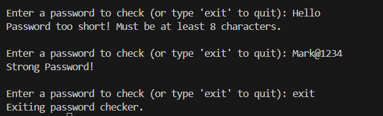

# 🔐 Password Strength Checker
A simple Python script that checks the strength of your password based on:
- Length
- Use of uppercase and lowercase letters
- Digits
- Special characters

## 🚀 Features

- Checks for minimum length (8 characters)
- Requires combination of character types
- Allows multiple attempts

## 📸 Example Output

## 💡 Future Enhancements

- Hide input using getpass
- Save password history to a file
- Add a GUI version
  
> Made with ❤️ by Dulyana

